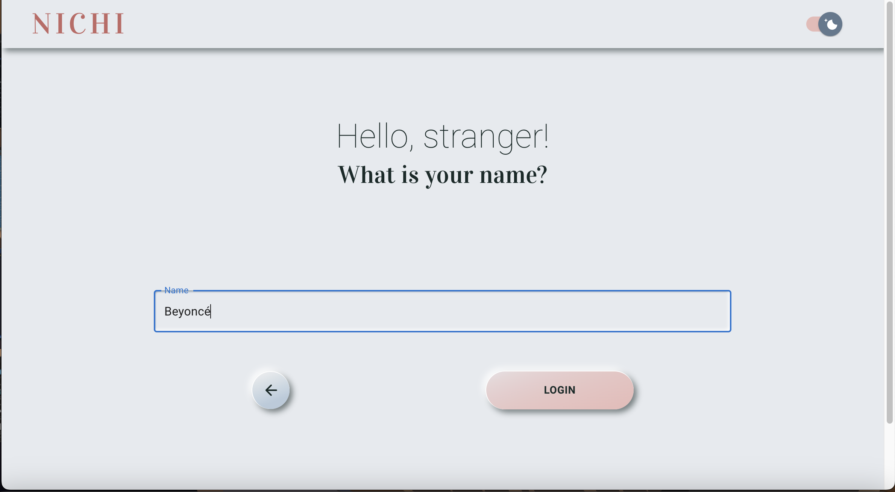
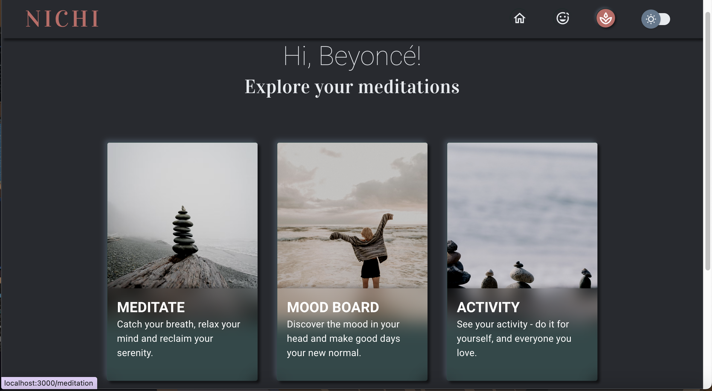
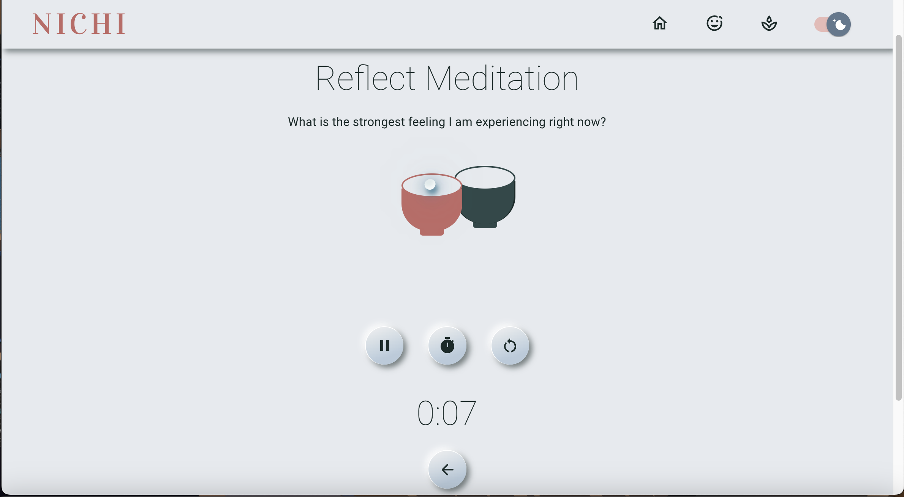
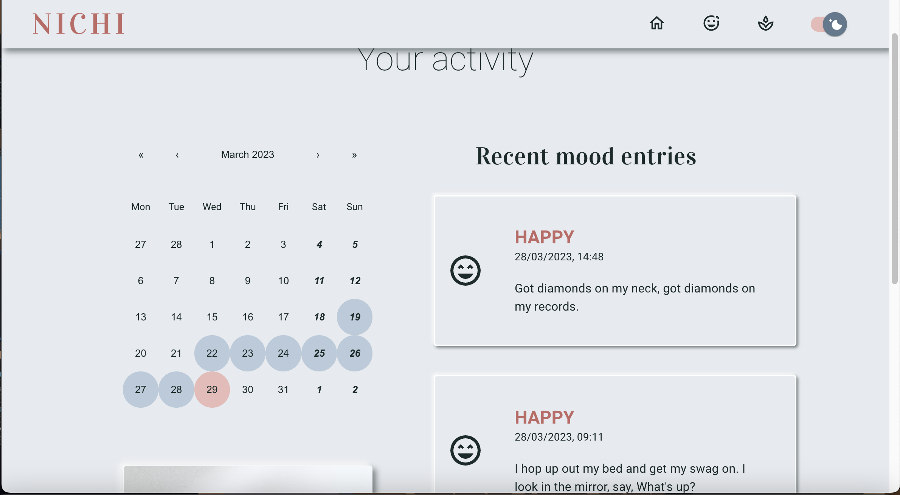

# NICHI - Energise your Mind

## Overview

This project is part of the Frontend Development Boot Camp course challenge "Mini Project 2 -  Client-Side Single-Page Application". 

Nichi app aims to strengthen one's resilience to daily stress by providing short mindfulness meditations and a mood journal which can be used as part of one's Cognitive Behavioural Therapy. Nichi App has a carefully crafted user interface that is meant to transport the user away from the hustle and bustle of the daily life into a space of tranquility.

Nichi "Energise Your Mind" currently has the following [features](#features):
* A welcoming home page
* A user log in page
* Mood Tracker Section
  * Allows user to record their moods using beautiful icons
* Meditation Section
  * Allows user to select one of three guided meditations
* Activity Log Section
  * Allows user to see their meditation and mood diary activities over time 
  * Allow users to select any day in the past and review how they feel on that day

The user mood tracking data and meditation history is currently stored in local storage. This data should be held in a more secure database as part of Nichi's future developments.

This project is the collective efforts of:
* Ewelina Amrogowicz [Github Page](https://github.com/EAmrogowicz)
* Alexandra Batrak [Github Page](https://github.com/alexandrabatrak)
* Pei Wang [Github Page](https://github.com/HaveTimeDrinkTea)

[Presentation Slides](https://www.canva.com/design/DAFeevC9oFE/MXPTLTBBf_51d5HEzakfwg/view?utm_content=DA[…]mpaign=designshare&utm_medium=link&utm_source=publishsharelink)

Video Presentation (2mins 9 sec) on on [YouTube](https://youtu.be/1fG3ZxOHuVY) or [Google Drive](https://drive.google.com/file/d/1Er0LUH09027YDBuHhXKjsJxPrdyAiCgz/view?usp=sharing).

## User Story

AS AN individual with a busy lifestyle

I WANT an app that can help me to strengthen my resilience to the daily hustle and bustle

SO THAT I can stay at the present moment and be able to perform better in daily life.

## Acceptance Requirements

The Nichi App:
* uses
  * React
  * Node.js
  * at least two libraries that was not covered by this Boot Camp
* Have both Get nad Post Routes for retrieving and adding new data
* Be deployed using Netlify
* Have a polished frontend / UI
* Meet good quality coding standards 
* Have a quality README.md   

## Table of Contents

- [Installation](#installation)
- [Usage](#usage)
- [Credits](#credits)
- [License](#license)
- [Features](#features)
- [Testing](#testing)
- [Contributions](#contributions)

## Installation

Technologies that have been used:

- React
- Navigation with `React Router`.
- Node.js
- CSS to customize styles
- Material UI 
  Material Design
- Framer Motion
- AJAX/API [Zen Quotes](https://zenquotes.io)

## Usage

[URL to Deployed Site: https://nichi-energiseyourmind.netlify.app](https://nichi-energiseyourmind.netlify.app)

[GitHub source files](https://github.com/EAmrogowicz/nichi-energiseYourMind-react)

**Screen Shot: Home Page**
 

**Screen Shot: User Log In Page**
 

**Screen Shot: Dashboard in Dark Mode**
 

**Screen Shot: Meditation on Reflection**
 

**Screen Shot: Mood Tracker Page**
 

**Screen Shot: Activity Log Page**
 

## Credits

* The royal-free bell mp3 audio files are from [bigsoundbank.com](https://bigsoundbank.com)

## License

This project is covered under the MIT License. Please refer to the repository
for more information.

## Features

### Main Features
* User are encouraged to log in with a username. This user name will be stored in the local storage and be used as greetings across the App
* The user can choose to
  * do a meditation
    * Breathing Meditation
    * Reflection Meditation
    * Body Scan / Spotlighting Meditation
  * record their current mood and add a journal entry to accompany the mood entry
  * view their activity log:
    * for the current day and any day in the past
    * Days streaks for logging an activity in Nichi.
    * the most recurring mood that has been recorded. 

### Future Development
* Daily and Weekly Goals with customizations and recommendations based on scientific research that can encourage the user to: 
  * develop habits that leads to a healthier lifestyle.
  * engage with nature more
  * do at least one meditation a day
  * record their moods and journal and see the results of daily meditation practice and weekly goals
* More types of Meditations and audio guided meditations based on scientific research.
  * Nichi app can be used to details around 18 different types of meditations to handle all kinds of moods from anger, sickness or frustrations to feeling accomplished, joyful or hope. 
* Awards badges to user for completing daily/weekly challenges as a motivation  
* Add user Profile and Settings
* Utilize MIU Theme and discard CSS
* Store user data in an external secure database

## Testing
* The App has been tested on various browsers on Windows and Mac

## Contributions
If you have any queries about Nichi App, please contact one of us via
* Ewelina
* Alexandra
* Pei's email: <havetimedrinktea@gmail.com>
